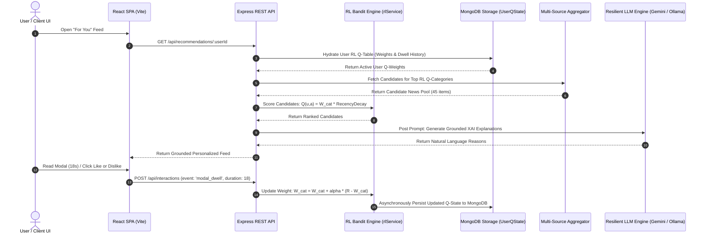

# Technical Design Specification & Architecture Document: NewsSync-AI

---

## 1. Executive System Architecture

**NewsLens-AI** is designed as a decoupled, multi-tier software architecture comprising:
1. **Client Tier (Presentation)**: Single-Page Application (SPA) built with React 18, Vite 6, and custom CSS design tokens. Features clean pure-text UI, equalized Like/Dislike action buttons, and live telemetry tracking.
2. **Application Server Tier (Business Logic)**: RESTful Node.js + Express backend implementing centralized error management (`errorHandler.js`), async flow control (`asyncHandler.js`), candidate pooling (`multiSourceService.js`), and intelligent category classification (`categoryDetector.js`).
3. **Reinforcement Learning & Intelligence Tier**: Contextual Multi-Armed Bandit engine (`rlService.js`) with continuous dwell-time rewards, $\epsilon$-greedy exploration, and Grounded Explainable AI (XAI) leveraging Google Gemini 3.6/3.5 Flash with local Ollama (`llama3.2:3b`) fallback.
4. **Data Persistence Tier (Storage & Telemetry)**: MongoDB storage for saved reading lists, interaction event logs, and persistent user RL Q-tables (`UserQState`).

---

## 2. High-Level Telemetry & Recommendation Flow



---

## 3. Reinforcement Learning Mathematical Specification

### 3.1. Q-Score Calculation
$$\text{Q-Score } Q(u, a) = W_{\text{category}(a)} \times \text{RecencyDecay}(a)$$

$$\text{RecencyDecay}(a) = \max\left(0.60,\; 1.0 - \frac{\text{HoursOld}(a)}{48} \times 0.40\right)$$

### 3.2. Continuous Reward Table ($R$)
| Action Event | Telemetry Condition | Reward Value ($R$) | Significance |
| :--- | :--- | :--- | :--- |
| `save` | Clicked Save button | **$+10.0$** | Maximum Intent |
| `like` | Clicked Like button | **$+8.0$** | High Positive Preference |
| `read` | Clicked Outbound Source link | **$+5.0$** | Strong Intent |
| `modal_dwell` | Modal open for $>15\text{s}$ | **$+5.0$** | Deep Reading |
| `modal_dwell` | Modal open for $5\text{s}-15\text{s}$ | **$+3.0$** | Moderate Reading |
| `modal_dwell` | Modal open for $2\text{s}-5\text{s}$ | **$+1.0$** | Glance |
| `modal_dwell` | Modal closed in $<2\text{s}$ | **$-4.0$** | Fast Skip Penalty |
| `dislike` | Clicked Dislike button | **$-8.0$** | Explicit Negative Penalty |
| `view` | Card open impression | **$+0.2$** | Non-decaying Baseline |

### 3.3. Temporal Difference (TD) Q-Weight Update Rule
$$W_{\text{cat}} \leftarrow \max\left(0.1, W_{\text{cat}} + \alpha \cdot \left[ R - W_{\text{cat}} \right]\right) \quad (\text{where } \alpha = 0.15)$$

---

## 4. Key Design Patterns

### 4.1. Strategy Pattern for Resilient LLM Inference
The LLM sub-system implements the **Strategy Pattern** across multiple models:
1. **Primary**: `gemini-3.6-flash`
2. **Secondary**: `gemini-3.5-flash`
3. **Tertiary**: `gemini-3.1-flash-lite`
4. **Local Fallback**: `ollama:llama3.2:3b`

### 4.2. Category Detector Fallback (`categoryDetector.js`)
Classifies incoming RSS/API articles lacking explicit category tags into standard topics (`sports`, `technology`, `business`, `science`, `world`) using weighted keyword matching.

### 4.3. Higher-Order Route Decorator (`asyncHandler`)
Wraps all controller routes, ensuring unhandled rejections route directly to centralized `errorHandler` middleware.

---

## 5. MongoDB Database Schemas

### 5.1. `UserQState` Schema (`models/userQStateModel.js`)
```javascript
{
  userId: { type: String, required: true, unique: true },
  weights: { type: Map, of: Number, default: {} },
  interactionCount: { type: Number, default: 0 },
  recentDwellCategory: { type: String, default: null },
  lastDwellDuration: { type: Number, default: 0 }
}
```

### 5.2. `Interaction` Schema (`models/interactionModel.js`)
```javascript
{
  userId: String,
  articleId: String,
  event: String, // 'view' | 'read' | 'modal_dwell' | 'like' | 'dislike' | 'save' | 'share' | 'ai_chat'
  duration: Number,
  category: String
}
```

---
**Document Revision**: 2.0 | **NewsLens-AI Architecture Team**
