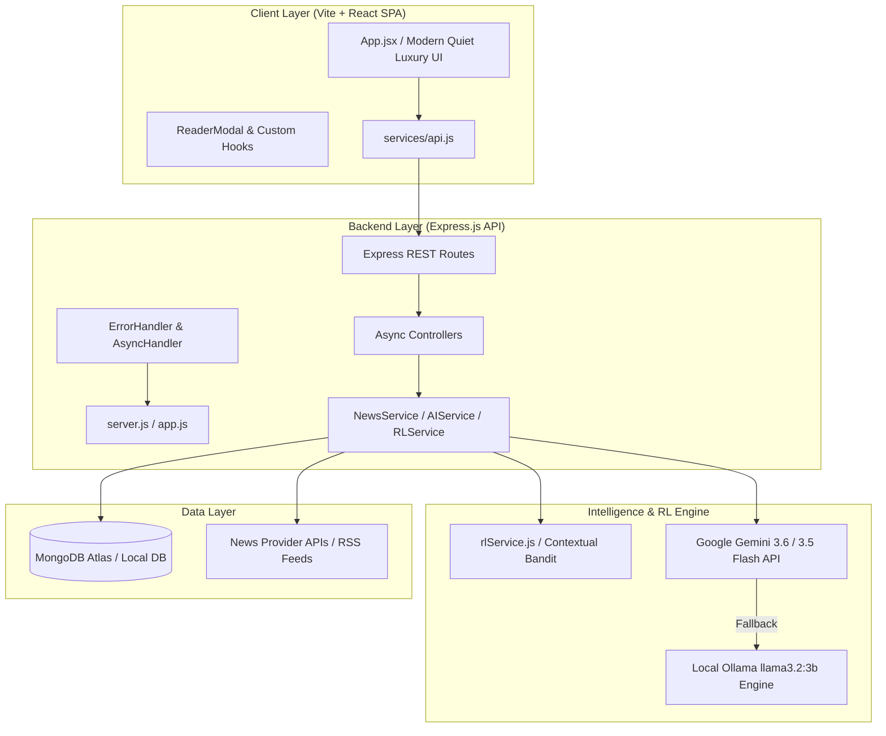

# NewsSync-AI — Real-Time RL Bandit Personalization Engine & Grounded AI Intelligence Dashboard
## Database Systems - BCSE302L

> **An advanced, production-grade Software Engineering project featuring Contextual Multi-Armed Bandit Reinforcement Learning (RL), Continuous Dwell-Time Telemetry, MongoDB Q-State Persistence, Multi-LLM Resilience (Google Gemini + Local Ollama), and Grounded Explainable AI (XAI).**

---

## Executive Summary

Traditional news recommendation systems rely on static offline ML pipelines (e.g., matrix factorization, batch embeddings, collaborative filtering) that suffer from cold-start latency, lack transparency, and fail to adapt to live user behavior in real time.

**NewsLens-AI** introduces a novel hybrid software architecture that combines a **Contextual Multi-Armed Bandit Reinforcement Learning (RL) Engine** with **Grounded Explainable AI (XAI)**. Built with a decoupled **Express.js API Backend** and a **Vite + React Frontend**, NewsLens-AI tracks real-time user interaction telemetry (explicit likes, saves, dislikes, outbound reads, and implicit reader modal dwell duration) to update category Q-weights online ($W_{\text{cat}}$) and persist them in MongoDB.

---

## Core Technical Features

- **Contextual Multi-Armed Bandit RL Engine**: Dynamically re-ranks news feeds online using continuous dwell-time reward signals ($+10.0$ Save, $+8.0$ Like, $+5.0$ Deep Dwell $>15\text{s}$, $-4.0$ Fast Skip $<2\text{s}$, $-8.0$ Dislike).
- **MongoDB Q-State Persistence**: Automatically persists user category weights ($W_{\text{cat}}$) to MongoDB (`UserQState`), preserving learned preferences across browser re-opens and server restarts.
- **Dynamic Top-Q Candidate Pooling**: Inspects active user Q-weights and dynamically fetches extra candidate news targeted specifically at the user's top 2–3 RL categories.
- *Grounded Explainable AI (XAI)**: Every recommended story features a transparent, human-centric rationale explaining *why* the story aligns with user interest based on real reading habits.
- **Multi-LLM Resilience Engine**: Primary inference using **Google Gemini 3.6 Flash / 3.5 Flash**, with automatic fallback to **Gemini 3.1 Flash-Lite** and local offline **Ollama (`llama3.2:3b`)**.
- **Immersive Dual-Panel Reader View**: Full-screen Apple-inspired modal with multi-paragraph reading mode, grounded Q&A drawer, and interactive AI analysis (Summarize, Explain, Key Points, Sentiment).
- **Obsidian & Titanium Quiet Luxury Design**: Sleek dark/light theme switching with custom hidden scrollbars, micro-animations, clean pure-text cards, and equalized Like/Dislike pill buttons.

---

## Architecture & Component Overview



---

## Directory Structure

```
NewsLens-AI/
├── client/                     # Vite + React Single-Page Application
│   ├── src/
│   │   ├── components/         # Component architecture
│   │   │   ├── ReaderModal/    # Modular Reader Modal sub-components
│   │   │   │   ├── ReaderActions.jsx
│   │   │   │   ├── ReaderAISection.jsx
│   │   │   │   └── ReaderUpNextCard.jsx
│   │   │   ├── ArticleCard.jsx
│   │   │   ├── Controls.jsx
│   │   │   ├── Header.jsx
│   │   │   ├── ReaderModal.jsx
│   │   │   ├── StateMessage.jsx
│   │   │   └── ViewTabs.jsx
│   │   ├── hooks/             # Custom React Hooks (useReadingTracker)
│   │   ├── services/          # API Client integration layer (api.js)
│   │   ├── utils/             # Pure utility functions (markdownFormatter)
│   │   ├── App.jsx            # Main App Orchestrator
│   │   └── index.css          # Design Tokens & Quiet Luxury CSS System
│   ├── package.json
│   └── vite.config.js
│
├── server/                     # Node.js + Express API Backend
│   ├── src/
│   │   ├── config/             # Environment & service configurations
│   │   ├── controllers/        # Express route handlers (wrapped in asyncHandler)
│   │   ├── mappers/            # Article normalization & sanitization
│   │   ├── middleware/         # Centralized error handling middleware
│   │   ├── models/             # Database models (SavedArticle, Interaction, UserQState)
│   │   ├── prompts/            # Grounded AI prompt engineering templates
│   │   ├── providers/          # Gemini, Ollama & News provider adapters
│   │   ├── services/           # RL service, news service, AI service
│   │   ├── utils/              # Category detector & helper utilities
│   │   └── server.js           # Server bootstrapper & MongoDB connector
│   ├── package.json
│   └── .env
│
├── PROFESSOR_SUBMISSION_REPORT.md # Academic 1-page Submission Report
└── README.md
```

---

## Quick Start & Developer Guide

### Prerequisites
* Node.js v18+
* MongoDB local instance or MongoDB Atlas URI
* Optional: Google Gemini API Key or local Ollama installation (`ollama run llama3.2:3b`)

### 1. Server Setup
```bash
cd server
npm install
cp .env.example .env
# Set MONGO_URI and GEMINI_API_KEY in .env
npm run dev
```

### 2. Client Setup
```bash
cd client
npm install
npm run dev
```
Open `http://localhost:3000` in your browser.

---
**License**: ISC | **Repository**: NewsLens-AI
